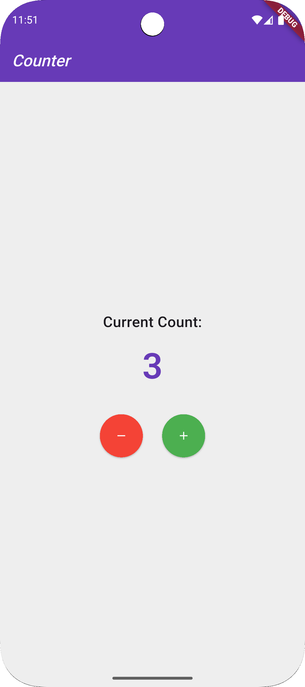

# Simple Flutter Projects

This repository contains two beginner-level Flutter projects built using the Dart programming language:

1. **Calculator App**  
   A basic calculator with a clean UI that supports standard arithmetic operations.

2. **To-Do List App**  
   A simple task manager that allows users to add, delete, and mark tasks using a fun emoji-based system.

3. **Counter App**  
   This is a simple and modern counter app built with **Flutter**, designed to demonstrate:
   - ✅ State management using `Provider`
   - ✅ Local data persistence using `SharedPreferences`
   - ✅ Smooth UI animations with `AnimatedSwitcher`
   - ✅ Clean and responsive user interface
---

## 📱 Screenshots

### Calculator App

### To-Do List App

### Counter App

