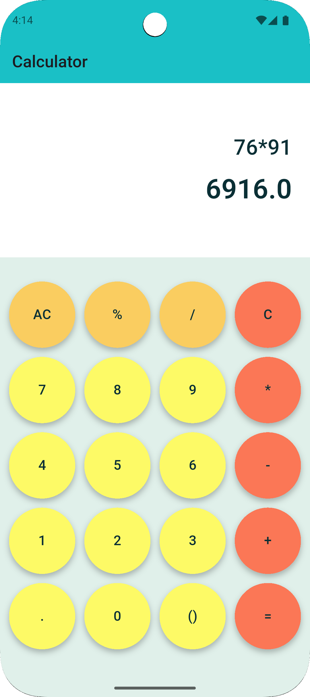
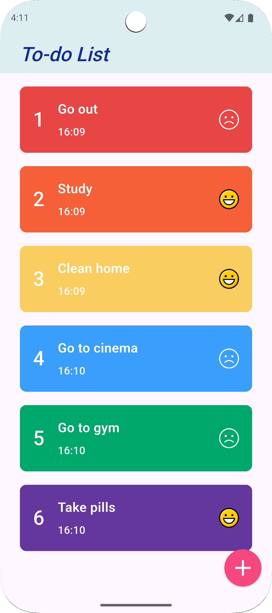

# Simple Flutter Projects

This repository contains two beginner-level Flutter projects built using the Dart programming language:

1. **Calculator App**  
   A basic calculator with a clean UI that supports standard arithmetic operations.

2. **To-Do List App**  
   A simple task manager that allows users to add, delete, and mark tasks using a fun emoji-based system.

---

## 📱 Screenshots

### Calculator App

### To-Do List App

---

## 🚀 Technologies Used
- Flutter
- Dart
- Material Design
- Basic State Management (`setState`)
